# VALAI - Progetto Icon 2024/2025

### Porcelli andrea mat. [775736] 

## Tabella dei Contenuti

- **Capitolo 0**
    - [Introduzione](#capitolo-0---introduzione)
    - [Valorant](#valorant)
    - [Definizione formale del gioco](#definizione-formale-del-gioco)
    - [Struttura del Progetto](#struttura-del-progetto)


- **Capitolo 1 - Dataset & Preprocessing**
    - [Raccolta dei Dati](#raccolta-dei-dati)
    - [Analisi Esplorativa sui Dati](#analisi-esplorativa-sui-dati)
    - [Preprocessing](#preprocessing)


- **Capitolo 2 - Apprendimento Supervisionato**
  - [Approccio](#approccio-1)
  - [Suddivisione dei Dati](#suddivisione-dei-dati)
  - [Scelta dei Modelli](#scelta-dei-modelli)
  - [Tuning degli Iperparametri](#tuning-degli-iperparametri)
  - [Addestramento & Test dei Modelli](#addestramento-dei-modelli)
  - [Valutazione dei Modelli](#valutazione-dei-modelli)
  - [Confronto dei Modelli](#confronto-dei-modelli)
    - [Decision tree](#decision-tree)
    - [Random forest](#random-forest)
    - [Logistic regression](#logistic-regression)
    - [Support vector machine](#support-vector-machine-svm)
    - [Artificial neural network](#artificial-neural-network-ann)
  - [Conclusioni](#conclusioni)


- **Capitolo 3 - Ragionamento Probabilistico**
    - [Motivazioni](#motivazione)
    - [Approccio](#approccio)
    - [Pareri e conclusioni](#pareri-e-conclusioni)


- **Capitolo 4 - Rappresentazione Relazionale**
  - [Costruzione della Knowledge Base](#costruzione-della-knowledge-base)
  - [Esempi di query](#esempi-di-query)


- **Capitolo 5 - Conclusioni**
    - [Risultati Ottenuti](#risultati-ottenuti)
    - [Possibili Sviluppi Futuri](#possibili-sviluppi-futuri)


# Capitolo 0 - Introduzione

## Introduzione

Il progetto qui presentato è stato realizzato per il corso di ICON 2024/2025, tenuto dal Professore Fanizzi Nicola presso l'Università degli Studi di Bari Aldo Moro.

Il progetto si pone con l'obiettivo di dimostrare le conoscenze acquisite durante il corso, applicandole a un dataset di un videogioco online.

## Valorant

[Valorant](https://it.wikipedia.org/wiki/Valorant) è un videogioco multiplayer competitivo della categoria FPS che coinvolge due squadre da cinque giocatori ciascuna.
Le due squadre si affrontano in due tempi da 12 round ciascuno su una mappa, i due tempi sono chiamati attacco e difesa.
Ogni giocatore può scegliere un personaggio, chiamato agente, che possiede abilità uniche ed ha a disposizione delle armi.

Le condizioni di vittoria sono due per ogni round:

- **Se si è in**
  - **Attacco**: la squadra attaccante deve innescare la bomba e difenderla fino alla sua esplosione.
  - **Difesa**: se innescata la bomba, la squadra difensiva deve disinnescarla per vincere il round.

- **Condizioni di vittoria:**
  - **Vittoria**: Vince la squadra che arriva per prima a 13 o in caso di pareggio (12 - 12) si continua come in pallavolo con tre round aggiuntivi.La vittoria viene attribuita a chi ne vince due su tre, nel caso di ulteriore pareggio si continua con la stessa modalità fino a determinare un vincitore.

- **Condizioni di pareggio:**
  - **Pareggio**: Il pareggio avviene su votazioni di entrambe le squadre se la partita si prolunga troppo, ma è molto raro.

- **Condizioni di sconfitta:**
  - **Sconfitta**: opposte a quelle di vittoria.

## Definizione formale del gioco

Ai fini del progetto, si vuole considerare un modello semplificato del gioco, facile da trattare e da analizzare pure da esterni.
Una motivazione aggiuntiva è che considerare tutte le possibili features aumenterebbe notevolmente il grado di difficoltà rendendo il progetto inutilmente complesso.

Il gioco semplificato è definito come segue:

- Dato un insieme di partite $M$ di un giocatore $p$ per ogni $m \in M$ si ha che:
  - $A$ l'insieme dei personaggi,
  - la partita $m$ è giocata con uno e un solo personaggio $a \in A$,
  - $out \in{\{win, loss, draw\}}$ l'outcome del gioco, ovvero se la partita è stata vinta/persa o pareggiata,

- azioni durante un round:
  - $p$ può uccidere un nemico $kill$,
  - $p$ può essere ucciso da un nemico $death$,
  - $p$ può aiutare un amico a uccidere un nemico $assist$.


## Obiettivo del Progetto

Ho deciso di avere due finalità per il progetto:

- Dimostrare le competenze acquisite durante il corso di ICON.
- Presentare una demo alla community di valorant per ottenere una API production key, così posso estendere il progetto.

Per fare ciò ho pensato a un task che potesse essere utile per l'azienda e affrontarlo in maniera più semplice ai fini di dimostrare sia le competenze acquisite e sia la fattibilità del task.

Sia $SR$ un vettore di dimensione $n$ dove $n$ è il numero di round giocati nella partita $m$.
$SR[i]$ contiene le statistiche comulative del giocatore $p$ al round $i$.

- **Task target in questo progetto**: Dato $SR[n]$ determinare se la partita $m$ è vinta o persa. 

- **[NON REALIZZATO] estensione finale**: feedback in real-time $\forall{i}$ determinare se la partita $m$ è più prona alla vittoria o alla sconfitta in base a $SR[i]$.

L' estensione a primo impatto può sembrare inutile e ridondante, ma si pensa che a fine game si può facilmente convertire il vettore delle predizioni in una scala di valutazione per il giocatore su quanto ha impattato sulla partita.

Ho deciso di suddividere il progetto in tre sub-task:

- **Sub_Task 1**: Apprendimento Supervisionato - Invece di dare un feedback real-time, si vuole predire l'outcome di una partita in base alle statistiche di un giocatore. Quindi siamo di fronte a un problema di **classificazione binaria**. Questo sub-task è utile in quanto si potrà successivamente riadattare l'agente per il task esteso.

- **Sub_Task 2**: Apprendimento della struttura - Apprendere la struttura del problema e come le varie statistiche dipendo l'una dall'altra è un informazione cruciale per capire quali statistiche sono più importanti per la predizione dell'outcome.

- **Sub_Task 3**: Rappresentazione e Ragionamento Relazionale - creare una knowledge base con la quale si possa fare inferenza sulle statistiche di un giocatore.

**Production_key**: Avere una production key consente di avere a disposizione uno spettro più ampio di dati e di poter fare analisi più approfondite.

## Struttura del Progetto
```
C:.
├───bayes # ragionamento probabilistico
├───datasets # dataset pre e post processing
├───displayers # funzioni per visualizzare i risultati
├───img
│   ├───ANN
│   ├───DT
│   ├───LR
│   ├───RF
│   ├───SVM
│   └───_general 
├───pre_processing # funzioni per il preprocessing
├───prolog # rappresentazione relazionale
│   └───pl_files # .pl
└───supervised_training #apprendimento supervisionato
```
**Attenzione:**
- in ```main.py``` si trova il codice usato per i capitoli 1 - 2
- in ```bayes/bayes.py``` si trova il codice usato per il capitolo 3
- in ```prolog/prolog_dialog.py``` si trova il codice usato per il capitolo 4

# Capitolo 1 - Dataset & Preprocessing

## Raccolta dei Dati

Il dataset che ho scelto di utilizzare è stato trovato su [Kaggle](https://www.kaggle.com/), si chiama [my first 1000 valorant games](https://www.kaggle.com/datasets/mitchellharrison/my-first-1000-valorant-games).

- Il dataset è composto da 1000 record e 19 Features.

| **Feature**       | **Descrizione**                                                                                                                             | **Dominio**                                                                |
|-------------------|---------------------------------------------------------------------------------------------------------------------------------------------|----------------------------------------------------------------------------|
| **game_id**       | Identificativo univoco per ogni partita                                                                                                     | {1..1000}                                                                  |
| **episode**       | Equivalente al significato di stagioni (calcio)                                                                                             | {0..9}                                                                     |
| **act**           | Finestre temporali su cui si divide un episodio                                                                                             | {1, 2, 3}                                                                  |
| **rank**          | Punteggio competitivo come in scacchi (granmaestro,maestro,maestro internazionale) nel gioco si usano i metalli come sistema di valutazione | {Gold 1, Platinum 2, Diamond 3, ...}                                       |
| **date**          | La data in cui si è svolta la partita                                                                                                       | {Date in formato "DD-MM_YYYY"}                                             |
| **agent**         | Il personaggio giocato in quella partita                                                                                                    | {Phoenix, Jett, Reyna, ...}                                                |
| **map**           | La mappa in cui si è svolta la partita                                                                                                      | {Bind, Ascent, Haven, ...}                                                 |
| **outcome**       | L'esito della partita (vittoria/sconfitta/pareggio)                                                                                         | {Win, Loss, Draw}                                                          |
| **round_wins**    | Numero di round vinti                                                                                                                       | $\mathbb{N}$                                                               |
| **round_losses**  | Numero di round persi                                                                                                                       | $\mathbb{N}$                                                               |
| **kills**         | Numero di uccisioni di giocatori nemici                                                                                                     | $\mathbb{N}$                                                               |
| **deaths**        | Numero di volte in cui si è stati uccisi dai nemici                                                                                         | $\mathbb{N}$                                                               |
| **assists**       | Numero di assist (aiuto ai compagni nell' uccidere un nemico)                                                                               | $\mathbb{N}$                                                               |
| **kdr**           | Rapporto uccisioni/morti calcolato con la formula $\frac{kills}{max\{1,death\}}$                                                            | {x ∈ ℝ                                                        x ≥ 0}       |                 |
| **avg_dmg_delta** | Differenza media per round tra i danni inflitti e i danni subiti su tutti i round.                                                          | {x ∈ ℝ}                                                                    |
| **headshot_pct**  | Percentuale di colpi che hanno colpito la testa del nemico (non include colpi mancati)                                                      | {x ∈ ℝ                                                        0 ≤ x ≤ 100} |                  |
| **avg_dmg**       | Danno medio inflitto per round ai nemici                                                                                                    | {x ∈ ℝ                                                        x ≥ 0}       |                          |
| **acs**           | Punteggio di combattimento basato su danni, uccisioni e assist. Media su tutti i round, **non si conosce come viene calcolato.**            | {x ∈ ℝ                                                        x ≥ 0}       |                          |
| **num_frag**      | Posizione nella classifica della squadra in base al numero di uccisioni (1 = più uccisioni).                                                | {1, 2, ..., 5} dove 5 è il numero di giocatori nella squadra               |

## Analisi Esplorativa sui Dati

Qui di seguito sono riportate alcune statistiche sui dati raccolti:
- **Le statistiche erano già state esplorate dalla community di kaggle [statistiche](https://www.kaggle.com/code/kanzeus/boost-this-valorant-player)**
- Ho riportato di seguito solo quelle più utili per il progetto:

### Nan e duplicati

```
NaN values in data:
game_id          0
episode          0
act              0
rank             0
date             0
agent            0
map              0
outcome          0
round_wins       0
round_losses     0
kills            0
deaths           0
assists          0
kdr              0
avg_dmg_delta    0
headshot_pct     0
avg_dmg          0
acs              0
num_frag         0

Duplicated values in data:0
```
### PERSONAGGIO - OUTCOME


### KILLS / HEADSHOTS% AVG TIMELINE 


### DISTRIBUZIONI 


## Preprocessing

Il preprocessing dei dati è una fase con molto valore ai fini di aumentare la qualità del modello, poichè essa è strettamente legata alla qualità dei dati.

Per questo ho deciso di effettuare le seguenti operazioni:
  - **Rimozione di Features che non danno informazioni utili ai fini della predizione dell' outcome**: `game_id`, `date`, `episode`, `act`, `rank`, `map`, `num_frag`.
    - `game_id` è un identificativo univoco per ogni partita, non ha senso pensare che sia una feature che influisce sull'outcome.
    - `date` la data non influisce sull'outcome.
    - `episode` e `act` sono feature che non influiscono sull'outcome sono dei termini usati in gioco per indicare le finestre temporali di un anno.
    - `rank` è un punteggio che indica il grado del giocatore all'inizio della parità, (analogo a scacchi `granmaestro` / `maestro`) non influisce sulla partita poichè nel sistema di ranking, i giocatori devono avere punteggio simile, il rank quindi non è una feature che contribuisce all' outcome. 
    - `map` la mappa non influisce sull'outcome della partita.
    - `num_frag` è la posizione nella classifica della squadra in base al numero di uccisioni, non influisce sull'outcome e inoltre noi vogliamo predire l'outcome basato solo sulle statistiche di un giocatore non su quelle di tutti.
    - `avg_dmg_delta` e `avg_dmg`: dipendono troppo strettamente dal `kdr` più il `kdr` è alto più il `avg_dmg` saranno alti e viceversa.
  - **Rimozione di Features Ridondanti**: `round_wins` e `round_losses` sono ridondanti rispetto all'`outcome`, `deaths` e `kills` sono ridondanti rispetto al `kdr`.
  - **Encoding delle Categorical Features**: ho deciso di utilizzare l'encoding one-hot per la feature categorica `agent` ed `outcome` però come vedremo successivamente regrediscono a features binarie.
  - **Taglio degli outliner**: ho deciso di usare il metodo [IQR](https://deeplearningitalia.com/outliers-nel-machine-learning-comprendere-il-loro-impatto-sullanalisi-dei-dati/#:~:text=Il%20metodo%20del%20range%20interquartile,pu%C3%B2%20essere%20rimosso%20dal%20dataset.) "taglio le due code della distribuzione di una feature in base ai quantili" per eliminare gli outliner su quelle feature che presentavano valori molto distanti dalla media, poichè possono influenzare negativamente i modelli.
    - **motivazioni:** In un game **squilibrato** le statistiche di un giocatore possono essere molto alte o molto basse, ma questo non dipende dal giocatore ma dal fatto che la partita è squilibrata possibili cause (uno o più giocatori si sono disconnessi, uno o più giocatori dimostrano comportamenti lenosi sulla propria squadra)
  - **Normalizzazione delle Features**: I modelli come **SVM** che lavorano sulle distanze sono molto sensibili alla scala delle features, normalizzare le features porta molto spesso a un miglioramento dei risultati.

### Attuazione

Il primo passo nel preprocessing è stato quello di visionare con opportuni grafici la distribuzione delle features.

---


---


---

**Nota: Si veda la presenza di valori estremi.**

**Scelte:**

  - L' `agent` è stata trasformata in una feature binaria, in quanto se considerassi quei personaggi con poche partite non avrei sufficienti dati per fare una predizione accurata.
  - L' `outcome` è stata trasformata in una feature binaria, in quanto se considerassi il pareggio avrei una motivazione analoga ad `agent`.
  - per `assists`, `kdr`, `headshot_pct`, `acs` ho usato il metodo IQR per eliminare gli outliner.

---


---

```
Valori NaN:
game_id         0
agent           0
kdr             0
assists         0
headshot_pct    0
acs             0
outcome         0

Valori duplicati: 0
```

---
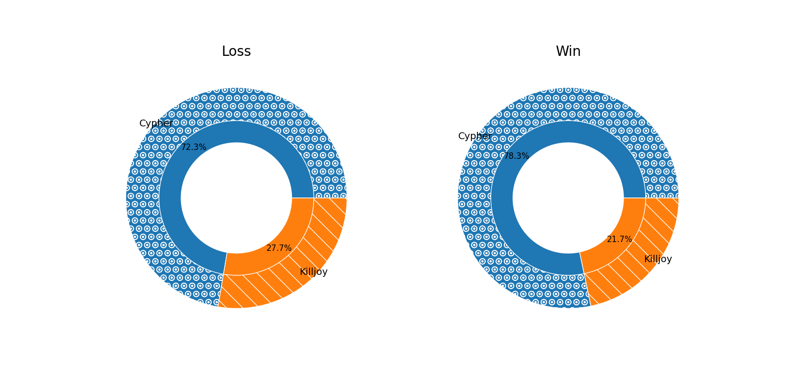

---

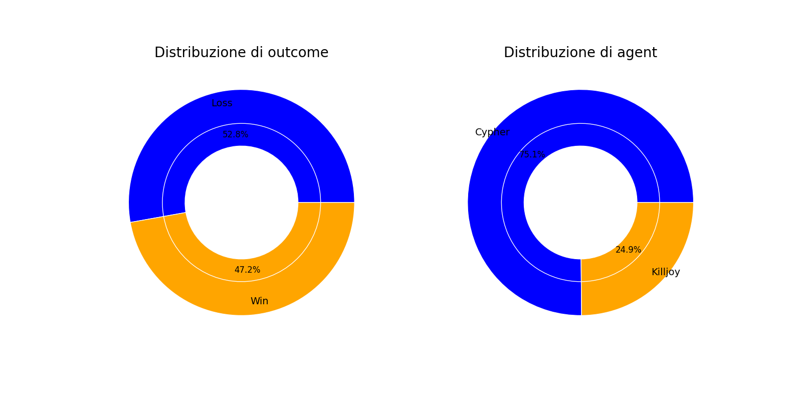

---

### Risultato

Come si può vedere abbiamo bilanciato le distribuzioni togliendo eventuali valori irrilevanti o che si distaccavano troppo dalla media.

I grafici a barre mostrano che le medie delle statistiche sono più bilanciate rispetto a prima, ma la standard deviation in qualche caso è aumentata questo non è da considerarsi un problema, poichè è più veritiero che un giocatore abbia delle prestazioni sparse piuttosto che tutte uguali (mediamente un giocatore non è consistente).

Non sono stati fatti vedere grafici post normalizzazione, poichè penso che siano più esplicativi i grafici pre normalizzazione con valori più naturali.

# Capitolo 2 - Apprendimento Supervisionato

L' apprendimento supervisionato è una tecnica di apprendimento automatico che consiste nel fornire al modello un insieme di dati etichettati, ovvero dati per i quali è già nota la risposta, e far apprendere al modello la relazione tra features e labels.

## Approccio

Nel nostro caso, Siamo di fronte a un problema di classificazione binaria, in quanto vogliamo in base alle statistiche di un giocatore predire se la partita è vinta o persa.

Per affrontare il problema ho deciso di utilizzare il seguente approccio:

- **Suddivisione dei Dati**: Che tecnica ho usato per suddividere i dati in training e test set.
- **(opzionale)** SMOTE: ho deciso di confrontare il dataset con e senza SMOTE, la differenza tra le classi è molto piccola quindi non dovrebbe influire molto, se il dataset fosse stato molto più grande e avesse conservato la distribuzione delle vittorie e sconfitte non avrei usato SMOTE, dato l'elevato costo computazionale.
- **Scelta dei Modelli**: ho scelto di utilizzare cinque modelli differenti per la classificazione: `DT`, `Random Forest`, `Logistic Regression`,`SVM`,`ANN`.
- **Tuning degli Iperparametri**: ho utilizzato la tecnica di **GridSearch** per trovare i migliori iperparametri per i modelli.
- **Addestramento & Test dei Modelli**: ho addestrato i modelli sui dati di training.
- **Valutazione dei Modelli**: ho valutato i modelli in base a diverse metriche.
- **Confronto dei Modelli**: ho confrontato i modelli tra loro.
- **Conclusioni**


## Suddivisione dei Dati

La k-fold cross validation è una tecnica che consiste nel dividere il dataset in k parti, addestrare il modello su k-1 parti e testarlo sulla parte rimanente, ripetendo l'operazione k volte.

Il dataset post-preprocessing conta 900 record, ho deciso di usare una tecnica di $k-fold$ cross validation con $k=10$ per una iniziale fase di tuning di iperparametri.

Successivamente ho addestrato i modelli come specificato nella fase di addestramento e test con una seconda $k-fold$ cross validation con $k=10$.

**Motivazione:** il dataset è molto piccolo ho voluto aumentare il k a 10, ho usato k = 5 **thumb rule** ma i risultati erano sensibilmente peggiori. Aumentare $k$ vuol dire porre enfasi sulla fase di training.


## Scelta dei Modelli

Ho scelto di utilizzare i seguenti modelli per la classificazione:

- Usati perchè solidi con i problemi di classificazione binaria.
  - **Support Vector Machine**: è un modello che cerca di trovare il miglior iperpiano che separa i dati in due classi è molto utilizzato per problemi di classificazione binaria.
  - **Logistic Regression**: è un modello di classificazione che si basa su una funzione logistica pure questo modello ideale per classificazioni binarie.


- Usati perchè si vuole vedere se ci sono differenze significative tra i modelli.
  - **Albero Decisionale**: è un modello che costruisce un albero di decisione in base alle features.
  - **Random Forest**: è un modello di classificazione che si basa su un insieme di alberi decisionali è usato perchè molte volte gli alberi decisionali sono molto sensibili ai dati.
  - **Rete Neurale**: è un modello di classificazione che si basa su un insieme di neuroni e layer.

### Motivazioni e pareri personali 

A priori non si può sapere quale modello sarà il migliore per il nostro problema, però voglio comunque fare delle considerazioni personali:

- `SVM` e `Logistic Regression` sono modelli nei quali ripongo più fiducia sulle performance in quanto sono ideati per affrontare questi problemi e sono efficienti ed efficaci.

Invece: 

- `DT` è molto sensibile ai dati e può presentare overfitting.
- `RF` è un modello composto da più alberi decisionali per mitigare l' overfitting.

- `DT e RF` funzionano molto bene quando le features sono facilmente separabili, ma nel caso di classificazione binaria soprattutto su delle features di input a valori continui non credo che siano i modelli migliori.

- `ANN` non so cosa aspettarmi, è un modello complesso quindi solo il confronto ci dirà se è un modello adatto al nostro problema.

## Tuning degli Iperparametri

Per trovare i migliori iperparametri per i modelli ho utilizzato la tecnica di `GridSearch`, che a differenza di una `random search` o di una `bayesian search`, esplora tutte le combinazioni possibili di iperparametri.

Non è consigliabile utilizzare `Gridsearch` poichè stiamo ponendo un fattore computazionale enorme.

---

```
dato un modello con 3 iperparametri e 3 valori per ogni iperparametro, 
il numero di combinazioni possibili è 3^3 = 27
```
formalizzabile come:

$N_{combinazioni} = \prod_{i=1}^{n} |V_i|$

Questo fattore va moltiplicato con il tempo di addestramento del modello. Su Datasets molto grandi è un approccio futile, ci possiamo permettere questo sforzo computazionale perchè il dataset è molto piccolo.

**Motivazioni**

Nel Mio caso, ho scelto di porre più attenzione al confronto generale tra i modelli piuttosto che entrare nel dettaglio di ogni singolo includendo tutti gli iperparametri.


### Addestramento dei Modelli

Ho addestrato i modelli sui dati attraverso la `k-fold cross validation` con $k = 10$ come descritto sopra.

Nell' addestramento l' unica problematica che ho riscontrato è stato il tempo di addestramento della rete neurale, che con un numero basso di epoche non riusciva a convergere, però alla fine ho risolto aumentandole e trovando un upper bound per il numero di epoche.

**SVM, DT, RT** e **LR** non hanno avuto grandi costi computazionali.

### Valutazione dei Modelli

Per valutare i modelli ho utilizzato le seguenti metriche:

- una learning curve per vedere se il modello presenta overfitting o underfitting.
  - **Precision**: è la percentuale di predizioni positive fatte dal modello che sono corrette.
  - **Recall**: è la percentuale di predizioni positive corrette fatte dal modello rispetto a tutte le predizioni positive.
  - **F1-Score**: è la media armonica tra precision e recall.

- Invece di usare le curve di apprendimento che valutano la prestazione di una metrica descritta ho usato quelle per l'errore sulla metrica ovvero $1 - metrica$ invece di avere un grafico che dovrebbe aumentare al numero di elementi nel test set, con l'errore diventano dei rami di iperbole.

Per ogni modello ho confrontato il dataset con e senza `SMOTE` per vedere se ci fossero differenze significative.

### Confronto dei Modelli

Per ogni modello ho strutturato la seguente lista:

- breve descrizione
- hyperparameters
- risultati senza SMOTE
- risultati con SMOTE
- conclusioni personali

### differenza SMOTE e NO SMOTE

```
smote is False the outcome distribution is
0.0    459
1.0    410

smote is True the outcome distribution is
0.0    459
1.0    459
```
---
### **Decision Tree**

Un decision tree è un modello usato per compiti di classificazione e regressione. È un albero binario, dove i nodi interni rappresentano le decisioni basate sui valori di una feature e le foglie rappresentano le previsioni finali.


**Hyperparameters**:

- resources:
  - [gini impurity](https://www.youtube.com/watch?v=u4IxOk2ijSs)
- **`criterion`**: Specifica la funzione per valutare la qualità delle suddivisioni.
  - `'gini'`: Imposta l'impurità di Gini come criterio.
  - `'entropy'`: Usa l'informazione di entropia per la suddivisione.
  - `'log_loss'`: Utilizza la perdita logaritmica per problemi di classificazione.
- **`max_depth`**: La profondità massima dell'albero.
  - `[5, 10, 15]`: Imponi un upper bound di $x \in max\_depth$.
- **`min_samples_split`**: Il numero minimo di campioni richiesti per dividere un nodo.
  - `[2, 5, 10]`: Valori più alti riducono il rischio di overfitting, ma aumentano il rischio di underfitting.

---
#### NO SMOTE

`Best params for decision_tree: {'criterion': 'log_loss', 'max_depth': 10, 'min_samples_split': 10}`

---

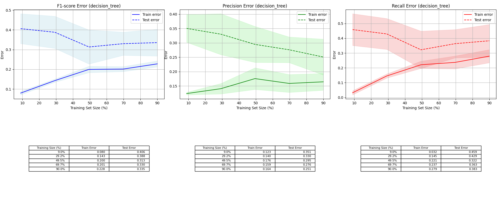

---

#### SMOTE

`Best params for decision_tree: {'criterion': 'gini', 'max_depth': 5, 'min_samples_split': 2}`

---

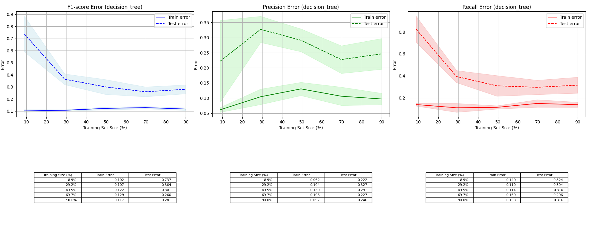

---

### **Random Forest**
- **`n_estimators`**: Numero di alberi nella foresta.
  - `[25, 50, 100]`
- **`max_depth`**: La profondità massima di ogni albero.
  - `[5, 10, 20]` analogo a decision tree.
- **`min_samples_split`**: analogo al decision tree, determina il numero minimo di campioni necessari per dividere un nodo.

---
#### NO SMOTE

`Best params for random_forest: {'max_depth': 10, 'min_samples_split': 10, 'n_estimators': 100}`

---

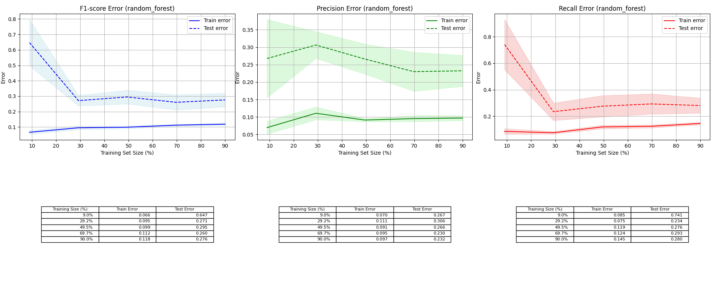

---
#### SMOTE

`Best params for random_forest: {'max_depth': 10, 'min_samples_split': 10, 'n_estimators': 50}`

---

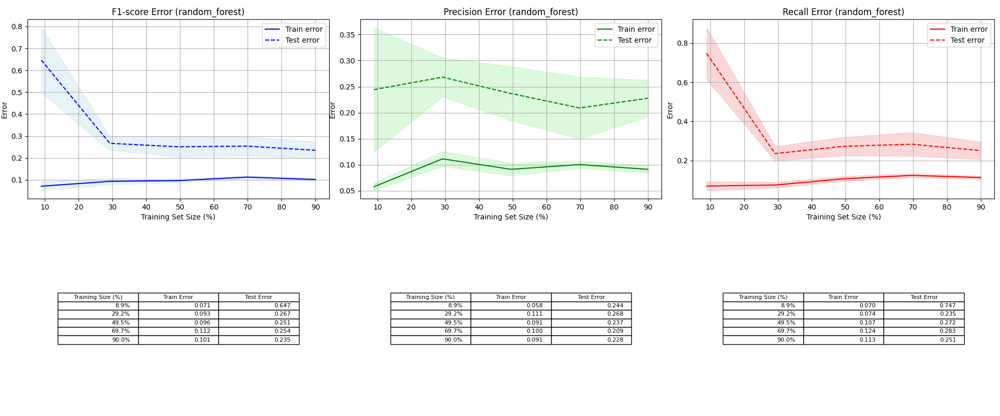

---

### **Logistic Regression**

La Logistic Regression è un modello utilizzato principalmente per problemi di classificazione binaria, usa una squashed function chiamata sigmoide per mappare i valori da uno spazio multi-dimensionale in un intervallo $[0,1]$ in $\mathbb{R}$.

- resources:
  - [logistic regression](https://www.geeksforgeeks.org/understanding-logistic-regression/)

- **`penalty`**: Specifica il tipo di regolarizzazione applicata.

  - la funzione obbiettivo con il parametro $l2$ diventa:
    $$
    l2 =
    \text{Minimizzare:} \frac{1}{n} \sum_{i=1}^{n} \text{log-loss}(y_i, \hat{y}_i) + \frac{\lambda}{2} ||w||_2^2
    $$

- **`C`**: Penalizzatore.
  - `[0.001, 0.01, 0.1, 1, 10]`: 
- **`solver`**: Algoritmo per l'ottimizzazione.
  - `'liblinear'`: [coordinate descent](https://www.youtube.com/watch?v=TiiF3VG_ViU) 
  - `'saga'`: Algoritmo basato sul gradiente stocastico, ma con una variante che sfrutta gradienti medi per velocizzare la convergenza che supporta regolarizzazione $l1,l2$.
- **`max_iter`**: Numero massimo di iterazioni per la convergenza.
  - `[100000, 150000]` 

**Motivazioni**: ho usato la regolarizzazione $l2$ perchè la $l1$ mi causava problemi di convergenza.

---

#### NO SMOTE
`Best params for logistic_regression: {'C': 10, 'max_iter': 100000, 'penalty': 'l2', 'solver': 'saga'}`

---

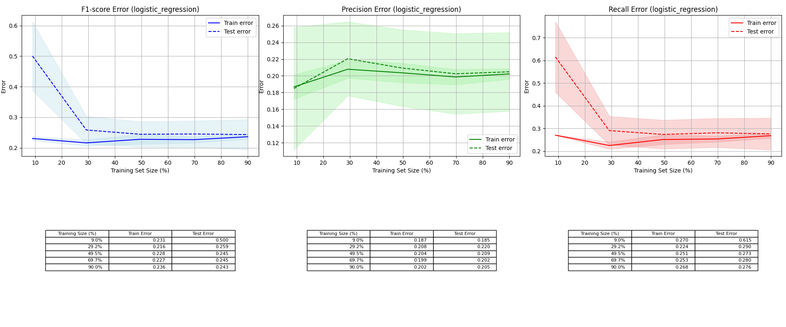

---

#### SMOTE
`Best params for logistic_regression: {'C': 10, 'max_iter': 100000, 'penalty': 'l2', 'solver': 'saga'}`

---

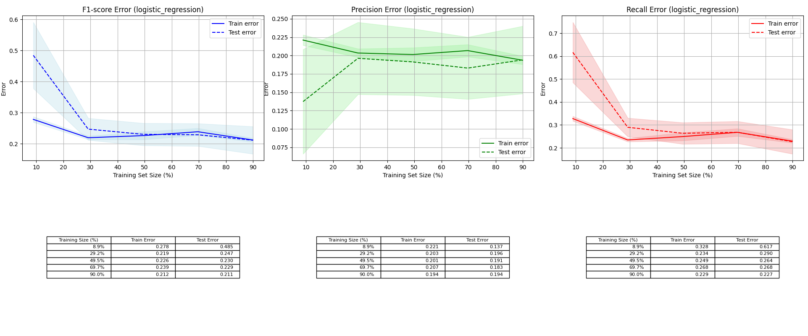

---

### **Support Vector Machine (SVM)**

Le SVM sono una delle prime tecniche di apprendimento supervisionato, cercano di trovare l'iperpiano che massimizza il margine tra le classi.

- **resources**:
  - [svm](https://www.youtube.com/watch?v=_YPScrckx28)
  - [kernel trick](https://www.youtube.com/watch?v=Q7vT0--5VII)
  - [What is the purpose of the C parameter in SVM?](https://eitca.org/artificial-intelligence/eitc-ai-mlp-machine-learning-with-python/support-vector-machine/svm-parameters/examination-review-svm-parameters/what-is-the-purpose-of-the-c-parameter-in-svm-how-does-a-smaller-value-of-c-affect-the-margin-and-misclassifications/#:~:text=The%20C%20parameter%20in%20SVM%20allows%20us%20to%20control%20the,expense%20of%20a%20narrower%20margin.)
- **`C`**: Parametro di regolarizzazione.
  - `[0.1,0.5, 1, 2]`: Controlla il bilanciamento tra massimizzazione del margine e minimizzazione dell'errore.
- **`kernel`**: Tipo di funzione kernel utilizzata per mappare i dati in uno spazio ad alta dimensione.
  - `'linear'`: Usa un kernel lineare (nessuna trasformazione).
  - `'rbf'`: Kernel a base radiale, ideale per dati non lineari.
  - `'poly'`: Kernel polinomiale.
  - `'sigmoid'`: Funzione sigmoide come kernel.
- **`gamma`**: Coefficiente del kernel RBF, polinomiale o sigmoide.
  - `'scale'`: Basato sull'inverso della somma delle varianze delle feature.
  - `'auto'`: Usa l'inverso del numero di feature.

---
#### NO SMOTE
`Best params for svm: {'C': 2, 'gamma': 'scale', 'kernel': 'linear'}`

---
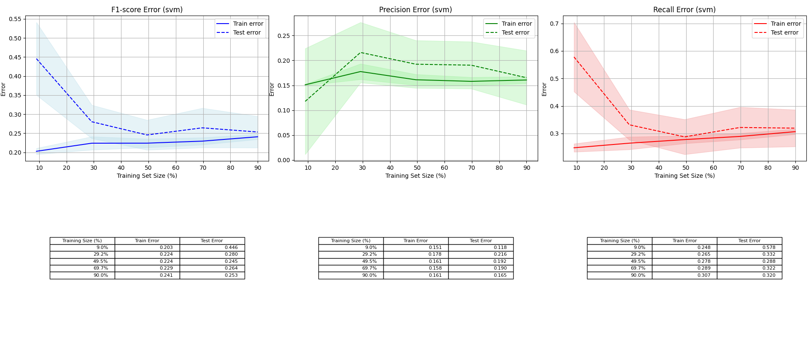

---
#### SMOTE
`Best params for svm: {'C': 2, 'gamma': 'scale', 'kernel': 'poly'}`

---
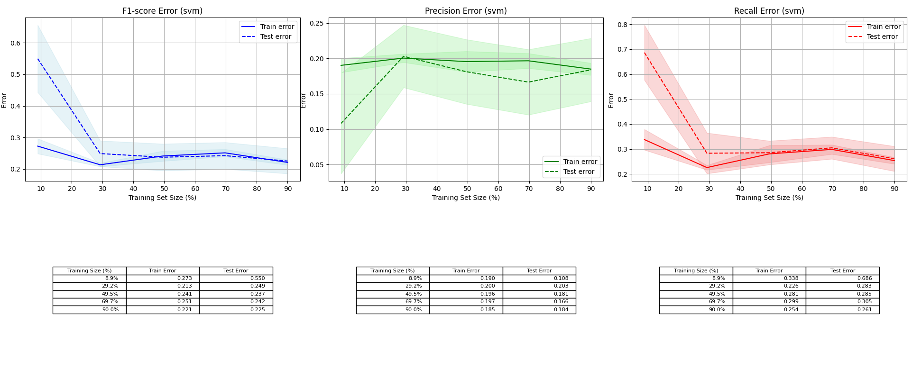

---

### **Artificial Neural Network (ANN)**

Le **Artificial Neural Networks (ANN)** sono modelli di apprendimento ispirati al funzionamento del cervello umano. Sono costituite da **neuroni artificiali** organizzati in strati:

1. **Strato di input**:
  - Riceve i dati delle features.

2. **Strati nascosti**:
  - Qui avviene l'elaborazione. Ogni neurone prende segnali dagli altri, li combina, li modifica con una funzione matematica (detta **funzione di attivazione**) e passa il risultato al livello successivo.

3. **Strato di output**:
  - Restituisce il risultato finale (es. una classificazione o un valore numerico).

#### Funzionamento:

- Ogni connessione tra i neuroni ha un peso che determina l'importanza del segnale.
- Il modello impara aggiustando i pesi durante l'allenamento per migliorare la precisione delle predizioni.
- Il processo di calibrazione dei pesi si chiama backpropagation, e usa un metodo di ottimizzazione come il **gradient descent** o **adam**.


- **resurces:**
  - [ANN](https://www.youtube.com/watch?v=aircAruvnKk)
  - [adam & sgd](https://www.youtube.com/watch?v=MD2fYip6QsQ)
- **`hidden_layer_sizes`**: Configurazione delle dimensioni dei layer nascosti.
  - `[(20,), (40,), (20, 10), (40,20)]`: Specifica il numero di nodi per ciascun layer.
- **`activation`**: Funzione di attivazione per i layer nascosti.
  - `'logistic'`: Funzione sigmoide.
  - `'relu'`: Funzione Rectified Linear Unit, molto comune.
- **`solver`**: Ottimizzatori
  - `'sgd'`: Discesa del gradiente stocastico.
  - `'adam'`: **non ho compreso molto bene come funziona l'ottimizzatore ma l' ho messo poichè ho trovato che è uno dei migliori**
- **`alpha`**: Parametro di regolarizzazione L2.
  - `[0.0001, 0.05]`: Valori più alti aumentano la penalizzazione per evitare overfitting.
- **`learning_rate`**: Politica di aggiornamento del learning rate.
  - `'constant'`: Tasso di apprendimento fisso.
  - `'adaptive'`: Il tasso diminuisce se le prestazioni del modello non migliorano.
- **`max_iter`**: Numero massimo di iterazioni per l’allenamento.
  - `[2000]`: Più iterazioni permettono di affinare il modello, ma aumentano il costo computazionale.
- **Note**:
  - ho provato più valori di max_iter partendo da 300 fino a 3000, ho notato che il modello convergeva mediamente a 2000 iterazioni.

---

#### NO SMOTE
`Best params for ann: {'activation': 'relu', 'alpha': 0.0001, 'hidden_layer_sizes': (40, 20), 'learning_rate': 'constant', 'max_iter': 2000, 'solver': 'adam'}`

---

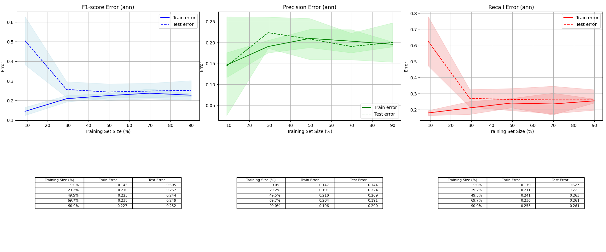

---

#### SMOTE
`Best params for ann: {'activation': 'relu', 'alpha': 0.05, 'hidden_layer_sizes': (40, 20), 'learning_rate': 'constant', 'max_iter': 2000, 'solver': 'adam'}`

---
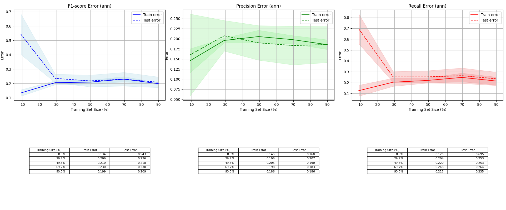

---

## Conclusioni

Come si può vedere dai grafici, **Decision tree** e **Random forest** non danno risultati significativi e indipendentemente dal dataset senza **SMOTE** presentano overfitting.

**Logistic regression**, **SVM** e **ANN** presentano risultati simili fra di loro indipendentemente dall' applicazione di **SMOTE**, con **ANN** che è leggermente migliore, ma c'è da considerare che il dataset è molto piccolo e ci possiamo permettere questo sforzo computazionale nell' eventualità di un dataset più grande i migliori modelli sarebbero stati **SVM** e **Logistic Regression**.

# Capitolo 3 - Apprendimento della Struttura

Il ragionamento probabilistico si basa sulla teoria delle probabilità per fare inferenze sui dati.

L'obiettivo del capitolo è quello di apprendere la struttura di un modello probabilistico basato sui dati, ovvero trovare le relazioni tra le variabili e le loro probabilità condizionate.

## Motivazione

Possiamo comprendere meglio le relazioni tra le variabili, capire quali variabili influenzano di più l'outcome e quali sono meno rilevanti.
È molto utile poichè nell' eventualità di estensione del progetto possiamo usare il modello come base per dare dei pesi alle statistiche del player, per poi ricavare una stima di valutazione.

## Approccio

[hill climb search](https://samanemami.medium.com/hill-climb-search-be70a399db8d)

Per affrontare il problema ho deciso di usare l'algoritmo di ricerca Hill Climb, che è un algoritmo di ricerca locale per massimizzare la funzione obbiettivo che nel nostro caso è il **K2 score.**

Ho usato il **K2score**, perchè sono riuscito a ottenere un risultato migliore rispetto al metodo di score BIC, BIC mi forniva un DAG con 2 nodi.

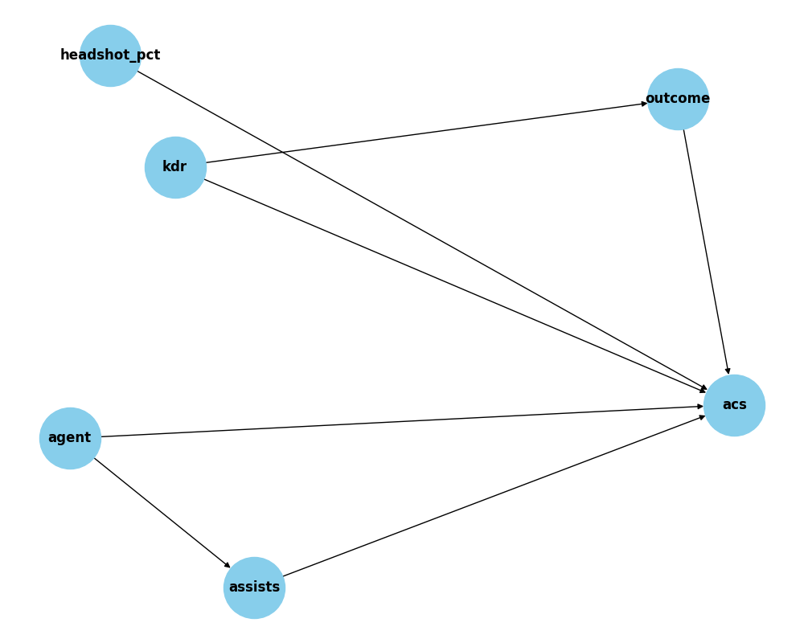


### Pareri e conclusioni

La struttura del modello è molto interessante, possiamo vedere che:

- l'`acs` che è un indicatore medio è l'unica foglia, il suo metodo di calcolo è sconosciuto poichè proprietario di Riot Games ha molto senso che sia l'unica foglia poichè rappresenta un indice medio di valutazione.
- l' `outcome` dipende principalmente dal kdr, logicamente ha senso poichè se un giocatore ha un kdr alto vuol dire che ha eliminato più nemici di quante volte sia morto, il che implica che le probabilità di vittoria aumentano.
- Il `personaggio` influenza gli `assists` è perfetto poichè un personaggio che ha funzioni di supporto aiuta i compagni a eliminare i nemici uno che ha funzioni di attacco elimina i nemici in maniera avida (senza aiutare i compagni).
- l' `headshot_pct` è l'unico valore che influenza solo l'acs, la motivazione è che i colpi alla testa non danno informazioni su quante volte un giocatore ha eliminato un nemico o quanti assists ha fatto, un giocatore porterebbe avere 70% di headshot_pct, ma avere poche kills o viceversa poca **headshot_pct**, ma molte kills si pensa a un fucile a pompa e si immagini la rosa è facile comprendere che mediamente non si fanno molti headshot.
- tutte le altre relazioni influenzano l'acs che come abbiamo detto ha molto senso poichè è un indice medio di valutazione.

Ho deciso di generare degli esempi per vedere se il modello è coerente con la realtà.


```
    agent  outcome  kdr  acs  assists  headshot_pct
0      1        1   1.9  298        4            29
1      0        0   0.9   98        2            17
2      1        1   1.3  163        3            25
3      0        0   0.6   69        4            40
```

**Nota**: Si veda come nel campione generato come il kdr è correlato all'outcome.

### Curiosità

L' immagine mostra delle statistiche di un altro giocatore con rank simile al giocatore del dataset si veda come l' ACS medio del giocatore è vicino a quelli del campione generato.


Non ho testato il modello in larga scala poichè sono interessato solo alle relazioni fra le variabili però facendo previsioni sullo stesso player da cui proviene la foto (stesso rank e stessi agenti utilizzati) ho ottenuto un risultato eccellente.

**La prima partita è vinta la seconda e la terza invece sono perse.**


```python
data = pd.DataFrame({
'agent': [1,0,1],
'kdr': [0.9,0.8,0.4],
'headshot_pct': [19,29,22],
})

probability_agent = model.predict(data)
print("Predicted probabilities:\n", probability_agent)
```

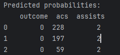

In conclusione gli assist non vengono predetti correttamente, ma il modello è molto accurato sia nel predire l'outcome che l'acs.

Questa parte del progetto è molto interessate, poichè si vuol far notare come si possano traslare le statistiche di un player su un altro, questa intuizione deve essere verificata su larga scala, però intuitivamente come descritto prima il rank non influenza le prestazioni di un giocatore, se i giocatori competono con lo stesso livello di abilità le statistiche nella media saranno simili ergo il si può creare un modello che predica mediamente le statistiche di un gruppo di giocatori con lo stesso livello di abilità e usarlo come base per valutare le prestazioni di un giocatore.

# Capitolo 4 - Rappresentazione Relazionale

[prolog](https://lpn.swi-prolog.org/lpnpage.php?pagetype=html&pageid=lpn-htmlse1#:~:text=Knowledge%20Base%201%20(KB1)%20is,woman(mia).)

Possiamo perciò concludere il progetto usando una knowledge base per inferire conoscenza dai dati.

Usiamo il prolog un linguaggio di programmazione logica:

1. il dominio che vogliamo rappresentare è una carriera di un giocatore di Valorant.
2. definiamo come individui le partite giocate dal giocatore.
3. definiamo le regole:
   - `prec(X,Y)` una partita X è precedente a una partita Y se X è stata giocata prima di Y.
   - `better(X,Y)` una partita X è stata giocata meglio di una partita Y se X ha un ACS maggiore di Y.
   - `newbie(X)` se la partita X è una delle prime partite giocate dal giocatore.
   - `high_kdr(X)` se la partita X ha un kdr maggiore di 1.5
   - `high_headshot(X)` se la partita X ha un headshot_pct maggiore di 30.
   - `high_assists(X)` se la partita X ha un numero di assists maggiore di 5.
   - `astonishing(X):` una partita è stata valutata come straordinaria.
   - `normal(X):` una partita è stata valutata come normale
   - `bad(X):` una partita è stata valutata come negativa.

## Costruzione della knowledge base

Vogliamo ragionare su una partita di Valorant, usare la knowledge base per fare inferenze sulle statistiche di una partita.

Ci poniamo quindi il seguente obbiettivo:

- Data una base di conoscenza con fatti relativi alle statistiche di una partita, e regole che descrivono relazioni tra statistiche, vogliamo fornire una valutazione al giocatore.

## Fatti e regole

In questo esempio, la base di conoscenza rappresenta delle partite di gioco (presumibilmente per un gioco come *Valorant*). Ogni partita è associata a vari attributi come `game_id`, `agent`, `kdr`, `assists`, `headshot_pct`, `acs` e `outcome`.

### Fatti:
Un **fatto** in Prolog è una dichiarazione di qualcosa che è vero. In questo caso, un fatto è una rappresentazione di una partita specifica nel dataset. Ogni partita è rappresentata come un fatto nel formato:

```prolog
partita(game_id, agent, kdr, assists, headshot_pct, acs, outcome).
```

Ecco come vengono costruiti i fatti nel codice:

1. **`game_id`**: Un identificatore univoco per la partita, ad esempio `g1`.
2. **`agent`**: L'agente o il personaggio utilizzato nella partita (ad esempio, "Chyper").
3. **`kdr`**: Il KDR (Kill-Death Ratio) della partita, che rappresenta il numero di uccisioni rispetto al numero di morti.
4. **`assists`**: Il numero di assist effettuati nella partita.
5. **`headshot_pct`**: La percentuale di colpi alla testa.
6. **`acs`**: L'ACS (Average Combat Score) della partita, un punteggio che misura l'efficacia di un giocatore in combattimento.
7. **`outcome`**: Il risultato della partita, che può essere "win" (vittoria) o "loss" (sconfitta).

Un esempio di fatto potrebbe essere:
```prolog
partita(g1, 'Chyper', 1.2, 5, 30, 250, 'win').
```

Nella partita identificata da `g1` giocata con l'agente *Chyper*, il giocatore ha avuto un KDR di 1.2, ha effettuato 5 assist, ha avuto il 30% di colpi alla testa, ha ottenuto un ACS di 250 e ha vinto la partita.

### Regole:
Una **regola** in Prolog è una dichiarazione che descrive una relazione tra fatti. Le regole usano una combinazione di fatti e altre regole per dedurre nuove informazioni. Ogni regola ha una condizione che deve essere vera affinché una conclusione (la parte dopo `:-`) sia vera.

1. **Regola `prec(X, Y)`**:
   La regola `prec(X, Y)` afferma che la partita `X` è precedente alla partita `Y` se il `game_id` di `X` è inferiore a quello di `Y`.

   ```prolog
   prec(X, Y) :- partita(X, _, _, _, _, _, _), partita(Y, _, _, _, _, _, _), sub_atom(X, 1, _, 0, ID_X), sub_atom(Y, 1, _, 0, ID_Y), atom_number(ID_X, Num_X), atom_number(ID_Y, Num_Y), Num_X < Num_Y.
   ```
   Questo significa che se esistono due partite `X` e `Y`, e se l'ID del gioco `X` è numericamente minore di quello di `Y`, allora `X` è considerata precedente a `Y`.

2. **Regola `better(X, Y)`**:
   La regola `better(X, Y)` afferma che la partita `X` è migliore della partita `Y` se l'ACS di `X` è maggiore di quello di `Y`.

   ```prolog
   better(X, Y) :- partita(X, _, _, _, _, ACS_X, _), partita(Y, _, _, _, _, ACS_Y, _), ACS_X > ACS_Y.
   ```

   In altre parole, se l'ACS di `X` è superiore a quello di `Y`, allora `X` è considerata "migliore" di `Y`.

3. **Regola `not_newbie(X)`**:
   La regola `not_newbie(X)` afferma che il giocatore non è più inesperto nel gioco se ha fatto più di 50 partite.

   ```prolog
   not_newbie(X) :- partita(X, _, _, _, _, _, _), sub_atom(X, 1, _, 0, ID_X), atom_number(ID_X, Num_X), Num_X > 50.
   ```

   Questo significa che le partite con un `game_id` maggiore di 50 sono considerate come partite in cui il giocatore ha un minimo di esperienza nel gioco.

4. **Regole per condizioni specifiche (`high_kdr`, `high_headshot`, `high_assists`)**:

  - **Regola `high_kdr(X)`**: Determina se una partita ha un KDR maggiore di 1.5.
    ```prolog
    high_kdr(X) :- partita(X, _, KDR, _, _, _, _), KDR > 1.5.
    ```

  - **Regola `high_headshot(X)`**: Determina se una partita ha una percentuale di colpi alla testa maggiore di 25.
    ```prolog
    high_headshot(X) :- partita(X, _, _, _, Headshot_Pct, _, _), Headshot_Pct > 25.
    ```

  - **Regola `high_assists(X)`**: Determina se una partita ha un numero di assist maggiore di 5.
    ```prolog
    high_assists(X) :- partita(X, _, _, Assists, _, _, _), Assists > 5.
    ```

5. **Regola `astonishing(X)`**:
   La regola `astonishing(X)` determina se una partita è "straordinaria" (astonishing). Una partita è considerata straordinaria se:
  - Non è una delle prime partite giocate nella carriera del giocatore ```not_newie(X).```
  - Ha almeno una delle seguenti condizioni: un KDR alto, una percentuale di colpi alla testa alta o un numero elevato di assist.
  - Ha una percentuale di partite precedenti peggiori di almeno il 75%.

   ```prolog
   astonishing(X) :-  not_newbie(X), (high_kdr(X); high_headshot(X); high_assists(X)),
                      findall(Y, (prec(Y, X), better(X, Y)), BetterGames),
                      length(BetterGames, CountBetter),
                      findall(Y, prec(Y, X), PreviousGames),
                      length(PreviousGames, CountPrevious),
                      CountPrevious > 0,
                      Ratio is CountBetter / CountPrevious,
                      Ratio >= 0.75.
   ```

   In questa regola, `findall/3` raccoglie tutte le partite precedenti a `X` che sono peggiori, e la partita è considerata straordinaria se la percentuale di tali partite peggiori è superiore o uguale al 75%.

6. **Regole `normal(X)` e `bad(X)`**:
   Le regole `normal(X)` e `bad(X)` determinano se una partita è considerata normale o negativa (rispettivamente). Funzionano in modo simile a `astonishing(X)`, ma con diverse soglie:

  - **Normal**: Se la partita è migliore del 25% ma inferiore al 75% delle partite precedenti.
  - **Bad**: Se la partita è migliore di meno del 25% delle partite precedenti.

   ```prolog
   normal(X) :-  not_newbie(X), findall(Y, (prec(Y, X), better(X, Y)), BetterGames),
                 length(BetterGames, CountBetter),
                 findall(Y, prec(Y, X), PreviousGames),
                 length(PreviousGames, CountPrevious),
                 CountPrevious > 0,
                 Ratio is CountBetter / CountPrevious,
                 Ratio >= 0.25, Ratio < 0.75.

   bad(X) :-  not_newbie(X), findall(Y, (prec(Y, X), better(X, Y)), BetterGames),
              length(BetterGames, CountBetter),
              findall(Y, prec(Y, X), PreviousGames),
              length(PreviousGames, CountPrevious),
              CountPrevious > 0,
              Ratio is CountBetter / CountPrevious,
              Ratio < 0.25.
   ```

- I **fatti** descrivono i dettagli delle partite, come il `game_id`, l'agente, il KDR, e altri attributi specifici della partita.
- Le **regole** utilizzano i fatti per inferire nuove informazioni, come determinare se una partita è "straordinaria" o "normale" in base ai valori delle partite precedenti, e confrontando il KDR, gli assist, o le percentuali di headshot.


## Esempi di query

Si riportano 3 partite per valutazione (elenco non esaustivo) si noti come le statistiche della partita influenzano la valutazione.

```
Astonishing games:

+-----------+---------+-------+-----------+-------------+-------+-----------+
|   Game ID | Agent   |   KDR |   Assists |   Headshot% |   ACS | Outcome   |
+===========+=========+=======+===========+=============+=======+===========+
|        62 | Cypher  |   1.5 |         6 |           5 |   258 | Win       |
+-----------+---------+-------+-----------+-------------+-------+-----------+
|        64 | Cypher  |   1.5 |         8 |           7 |   248 | Win       |
+-----------+---------+-------+-----------+-------------+-------+-----------+
|        69 | Cypher  |   1.2 |         6 |           8 |   238 | Win       |
+-----------+---------+-------+-----------+-------------+-------+-----------+

Normal games:
+-----------+---------+-------+-----------+-------------+-------+-----------+
|   Game ID | Agent   |   KDR |   Assists |   Headshot% |   ACS | Outcome   |
+===========+=========+=======+===========+=============+=======+===========+
|        51 | Cypher  |   1.3 |         9 |          10 |   211 | Win       |
+-----------+---------+-------+-----------+-------------+-------+-----------+
|        52 | Cypher  |   0.8 |         6 |           8 |   172 | Loss      |
+-----------+---------+-------+-----------+-------------+-------+-----------+
|        53 | Cypher  |   0.9 |         8 |           9 |   212 | Win       |
+-----------+---------+-------+-----------+-------------+-------+-----------+

Bad games:
+-----------+---------+-------+-----------+-------------+-------+-----------+
|   Game ID | Agent   |   KDR |   Assists |   Headshot% |   ACS | Outcome   |
+===========+=========+=======+===========+=============+=======+===========+
|        54 | Cypher  |   0.6 |         1 |          20 |   115 | Loss      |
+-----------+---------+-------+-----------+-------------+-------+-----------+
|        58 | Cypher  |   0.6 |         3 |          12 |   132 | Loss      |
+-----------+---------+-------+-----------+-------------+-------+-----------+
|        65 | Cypher  |   0.7 |         5 |          12 |    89 | Win       |
+-----------+---------+-------+-----------+-------------+-------+-----------+
```

### Possibili Upgrade

Questa knowledge base è una demo può essere utile per valutare le prestazioni di un giocatore, ma la piena potenzialità si può raggiungere affiancandola da dei modelli che fanno predizioni sulle statistiche di un giocatore e usare la knowledge base per valutare le prestazioni.


# Capitolo 5 - Conclusioni

### Risultati ottenuti

Posso concludere di aver ottenuto dei risultati ottimi, sono rimasto molto soddisfatto dell' apprendimento della struttura, poichè ho condiviso questa informazione su un server della community di Valorant e molti hanno concordato sulla struttura ritenendola coerente.

Bisogna ammettere che non mi aspettavo la dipendenza del `kdr` sull' `outcome` e l' `acs` su tutte le altre variabili, ma dopo le eventuali riflessioni abbiamo motivazioni valide per queste relazioni.

Riot mette a disposizione la possibilità di contattare i developer presentando il progetto e l' idea di un possibile sviluppo futuro sarebbe fattibile.

### Possibili Sviluppi Futuri

La knowledge base in prolog si può ampliare con nuove regole e fatti in tal modo che a ogni round si può fare inferenze sulle statistiche di un giocatore e predire l' esito della partita a lunga andata avvisando il giocatore che sta avendo prestazioni scadenti o viceversa.

Si potrebbe risalire a come l' acs viene calcolato apprendendo la struttura su dataset più ampi risalendo dalla probabilità condizionata di `acs` a un vettore di peso sulle altre statistiche.

